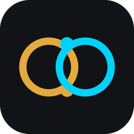
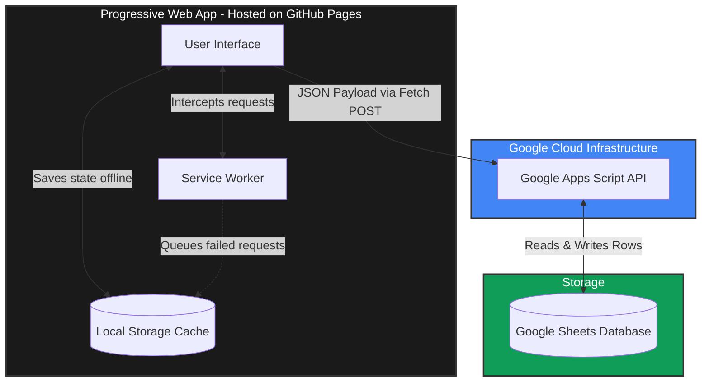

<p align="center">
  
</p>

<h1 align="center">SyncShift</h1>
<p align="center">
  <strong>Asynchronous EA Dispatch & Dual-Timezone Command Center</strong>
</p>

<p align="center">
  
  
  
</p>

---

## 📖 Executive Summary: What is SyncShift?

SyncShift is a specialized web application designed to help a business founder and their Executive Assistant work together seamlessly across different countries and time zones. Its primary purpose is to stop important tasks, ideas, and follow-up messages from getting lost in crowded email inboxes or text message conversations. Instead of forcing a busy business owner to fill out complex spreadsheets, this application acts as a clean, shared digital desk that automatically organizes their thoughts into actionable steps.

The application is built to be extremely easy to understand and navigate. At the very top of the screen, a visual time tracker shows the current time in both the United Kingdom and the Philippines. It clearly highlights the exact hours when both people are awake and working at the same time, which completely removes the confusion of scheduling meetings.

Below the time tracker, there is a simple text box called the Brain Dump. The business founder can type a natural, everyday sentence like, "Book a restaurant for tomorrow night," and press one button. The application is smart enough to automatically categorize the task, assign a deadline, and place it directly into the Executive Assistant's organized list.

The middle section of the screen holds this daily task list, which is automatically sorted so the most urgent items always remain at the top. When the Executive Assistant completes an assignment, they simply click a button labeled "Done," and the shared database updates instantly for the founder to see. At the end of the day, the assistant can click a single button to generate a perfectly formatted summary report of everything that was accomplished.

At the bottom of the screen, there is a follow-up tracker for external relationships. If the assistant contacts a client or a job candidate and does not receive a reply for forty-eight hours, the application provides a clear visual warning to remind the assistant to send another message.

Ultimately, this application is necessary because standard spreadsheets are difficult to read on mobile phones and require too much manual clicking to update. This application solves those problems by providing a fast, mobile-friendly screen that even saves your work when the internet connection is temporarily lost. It handles all the administrative organization automatically, which gives the Executive Assistant more free time to focus on completing the actual work for the business.

---

## 🏗️ System Architecture

SyncShift operates on a modern, serverless architecture that prioritizes offline reliability and zero-cost scaling.



### Data Flow Lifecycle:

1. **Input:** The user types a command into the PWA.
2. **Local Commit:** The app immediately saves the data to the browser's `localStorage`, providing an instant UI update without waiting for loading screens.
3. **Dispatch:** The app sends a `fetch` request containing a secure token and JSON payload to the Google Apps Script Web App URL.
4. **Validation & Storage:** Google Apps Script verifies the token, matches the route to the correct spreadsheet tab (Tasks, Nudges, or Content), appends the row, and copies necessary formatting.
5. **Offline Queue:** If the user is on an airplane or loses connection, the request is stored in an `offlineQueue` and automatically pushed to the server the moment the internet connection returns.

---

## ✨ Core Features & Real Business Value

| Feature | How It Works | Business Value |
| --- | --- | --- |
| **🧠 Natural Language Parsing** | The "Brain Dump" reads plain text and automatically extracts the category, urgency, and deadline based on keywords. | **Saves Time:** The Founder spends 2 seconds typing a thought rather than 30 seconds filling out a form. |
| **🌍 Visual Overlap Tracker** | Calculates and visually displays the 5-hour overlap window between UK (GMT) and Philippines (PHT). | **Prevents Bottlenecks:** Stops both parties from waiting for answers while the other person is sleeping. |
| **📶 Offline-First Reliability** | Uses a Service Worker to cache the application and queue network requests. | **Accessibility:** Can be used on a subway, during a flight, or in a cellular dead zone without losing data. |
| **📋 Automated Handover** | Clicking "Copy Daily Handover" generates a markdown-formatted summary of Completed, Pending, and Blocked tasks. | **Standardization:** Creates a professional, uniform daily reporting structure with a single click. |
| **⏳ 48-Hour Nudge Logic** | Highlights CRM contacts in red if they have not responded to a message within 48 hours. | **Revenue Protection:** Ensures no investor, client, or key candidate falls through the cracks. |

---

## 🛠️ Technology Stack

* **Frontend:** Vanilla JavaScript (ES5/ES6), HTML5, CSS3. No heavy frameworks (React/Vue) were used to ensure the app loads instantly on weak mobile networks.
* **Hosting:** GitHub Pages (Free, highly reliable static hosting).
* **API Middleware:** Google Apps Script (Serverless execution, deployed as a Web App).
* **Database:** Google Sheets (Accessible, easily auditable by non-technical stakeholders, zero cost).
* **Security:** Shared-secret token authentication for API requests.

---

## 🚀 Deployment Instructions

1. **Clone the Repository:**
Extract the repository files into your local environment or GitHub Codespaces.
2. **Deploy Google Sheets Backend:**
* Create a new Google Sheet.
* Open **Extensions > Apps Script**.
* Paste the contents of `backend/Code.gs`.
* Deploy as a **Web App** (Execute as: Me, Access: Anyone).


3. **Configure the PWA:**
* Open `js/app.js`.
* Paste your Apps Script Web App URL into the `SCRIPT_URL` variable.
* Ensure your secure `TOKEN` matches the token in `Code.gs`.


4. **Push to Live:**
* Commit the changes to your `main` branch.
* GitHub Actions will automatically deploy the Progressive Web App to GitHub Pages.


```

